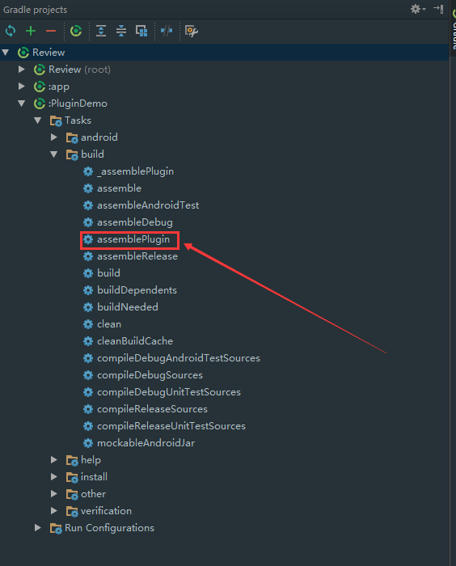
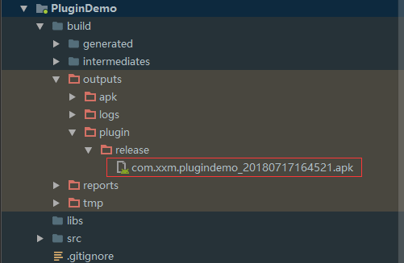

# Review
Review

## 1、Theme.AppCompat.Light.NoActionBar
```xml
    <!-- Base application theme. -->
    <style name="AppTheme" parent="Theme.AppCompat.Light.NoActionBar">
        <!-- Customize your theme here. -->
        <item name="colorPrimary">@color/colorPrimary</item>
        <item name="colorPrimaryDark">@color/colorPrimaryDark</item>
        <item name="colorAccent">@color/colorAccent</item>
        <!-- 放在页面跳转时出现短暂的黑屏-->
        <item name="android:windowIsTranslucent">true</item>
    </style>
```
使用Theme.AppCompat.Light.NoActionBar 主题可以直接去掉ActionBar


## 2、Retrofit

1、创建Retrofit实例
```java
Retrofit retrofit = new Retrofit.Builder()
                .baseUrl("https://www.sojson.com/open/api/")
                .build();
```
**注：**  baseUrl 中的路径(path)必须以 / 结束


2、形如json.shtml?city=北京的url链接不能用@PATH注解，使用@Query注解
```java

  @GET("weather/json.shtml")
  Call<ResponseBody> weatherOfCity(@Query("city") String city);

```


## 3、VirtualApk

VirtualApk的[官网](https://github.com/didi/VirtualAPK)


**Host Project**

1、Add a dependency in build.gradle in root of host project as following.

```groovy

dependencies {
    classpath 'com.didi.virtualapk:gradle:0.9.8.4'
}
```

2、Apply plugin in application module of build.gradle.

```groovy
apply plugin: 'com.didi.virtualapk.host'
```


3、Compile VirtualAPK in application module of build.gradle.

```groovy
compile 'com.didi.virtualapk:core:0.9.6'

```


4、Modify proguard rules to keep VirtualAPK related files.


```proguard
-keep class com.didi.virtualapk.internal.VAInstrumentation { *; }
-keep class com.didi.virtualapk.internal.PluginContentResolver { *; }

-dontwarn com.didi.virtualapk.**
-dontwarn android.**
-keep class android.** { *; }
```

5、在宿主中新建一个Application继承自Application，并在其中重写attachBaseContext方法，在方法里初始化插件


```java

@Override
protected void attachBaseContext(Context base) {
    super.attachBaseContext(base);
    PluginManager.getInstance(base).init();
}

```

一定要注意要在宿主的清单文件中声明自己重写的Application。

6、加载插件

```java

    @Override
    public void onCreate() {
        super.onCreate();
        PluginManager pluginManager = PluginManager.getInstance(this);
        //此处是当查看插件apk是否存在,如果存在就去加载(比如修改线上的bug,把插件apk下载到sdcard的根目录下取名为 reviewPlugin.apk)
        File apk = new File(getExternalStorageDirectory(), "reviewPlugin.apk");
        if (apk.exists()) {
            try {
                Log.i(TAG, "准备加载...");
                pluginManager.loadPlugin(apk);
            } catch (Exception e) {
                e.printStackTrace();
            }
        }

    }
```
注意要添加SD卡的权限


**Plugin Project**

1、Add a dependency in build.gradle in root of plugin project as following.

```groovy
dependencies {
    classpath 'com.didi.virtualapk:gradle:0.9.8.4'
}
```

2、Apply plugin in application module of build.gradle.
```groovy
apply plugin: 'com.didi.virtualapk.plugin'
```

3、Config VirtualAPK. Remember to put following lines at the end of build.gradle.

```groovy
virtualApk {
    packageId = 0x6f            // 插件资源id，避免资源id冲突
    targetHost='../Review/app'  // 宿主路径，可以使相对路径也可以是绝对路径
    applyHostMapping = true     // 表示插件是否开启apply mapping功能
}

```


4、生成插件工程

双击下图的assemblePlugin



注意，插件的名称一定是在宿主中规定好的名称。插件包均是Release包，不支持debug模式的插件包。


5、插件APK的位置




## 4.common.gradle的使用

**1.project中导入**

project的build.gradle中导入

```groovy
  apply from: 'common.gradle'
```

**2.module引用**

在module中根据需要引用定义的方法
```text
android {
    ....
    defaultConfig {
        ....
        versionName "2.0_" + getGitHeadRefsSuffix()
        ....
    }
    ....
}
```


